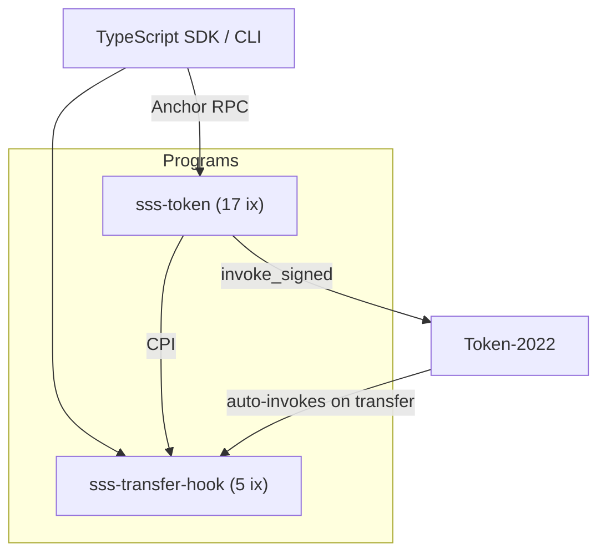

# Solana Stablecoin Standard (SSS)

A two-tier stablecoin specification for Solana built on Token-2022 with role-based access control, compliance enforcement, and reserve attestation.

## Architecture



**Config PDA** acts as mint authority, freeze authority, and permanent delegate -- all privileged operations go through the program's 7-role access control layer.

## Quick Start

```bash
git clone https://github.com/solanabr/solana-stablecoin-standard.git
cd solana-stablecoin-standard && yarn install
anchor build
anchor test  # runs 577 tests against a local validator
```

Prerequisites: Rust, Solana CLI (Agave 3.0.x), Anchor 0.32.1, Node.js >= 20, Yarn v1.

## Presets

**SSS-1 (Basic)** -- Mint/burn, freeze/thaw, pause, 7-role RBAC, minter quotas, metadata, reserve attestation, stablecoin registry.

**SSS-2 (Compliance)** -- Everything in SSS-1, plus transfer hook (blacklist enforcement on sender AND receiver), permanent delegate (asset seizure), optional default-frozen accounts, CPI blacklist management.

## Features

- **7-role access control** -- Minter, Burner, Pauser, Freezer, Blacklister, Seizer, Attestor. No single key can do everything.
- **Two-step authority transfer** -- Propose-accept pattern prevents accidental lockout
- **Minter quotas** -- Cumulative caps with overflow-safe tracking
- **Reserve attestation** -- On-chain proof of reserves; auto-pauses if undercollateralized
- **Stablecoin registry** -- Every mint creates a `RegistryEntry` PDA; discover all SSS stablecoins via `getProgramAccounts`
- **Dual pause** -- Manual pause (Pauser role) and attestation auto-pause are independent flags; both must be clear
- **Oracle price guard** -- SDK-level Pyth integration blocks minting when peg deviates beyond threshold
- **Transfer hook** -- Checks both sender and receiver against blacklist on every transfer (OFAC-grade)
- **Asset seizure** -- Permanent delegate enables Seizer role to recover tokens from blacklisted accounts
- **Treasury protection** -- Cannot freeze the treasury account
- **HMAC webhooks** -- Backend delivers signed webhook events with replay protection
- **20 CLI commands** -- Full operational toolkit (`init`, `mint`, `burn`, `freeze`, `blacklist`, `seize`, `attest-reserves`, etc.)
- **Frontend dashboard** -- Next.js + wallet adapter, deployed on Vercel
- **Terminal UI** -- `blessed`-based admin TUI for real-time monitoring

## Program IDs (Devnet)

| Program | Address |
|---------|---------|
| sss-token | `tCe3w68q2eo752dzozjGrV8rwhuynfz6T4HtquHf1Gz` |
| sss-transfer-hook | `A7UUA9Dbn9XokzuTqMCD9ka4y7x1pQBHJERa92dGAHKB` |

## Testing

```bash
anchor test                                             # 395 integration tests
cd sdk/core && npx jest                                 # 135 SDK unit tests
cargo test --manifest-path trident-tests/Cargo.toml     # 47 property-based tests
```

Coverage: role matrix (103 tests), compliance flows (38), token edge cases (40), authority + pause (30), E2E lifecycles (SSS-1 + SSS-2), reserve attestation, registry, oracle guard, and more.

Fuzz targets for six instruction categories are defined using [Trident](https://ackee.xyz/trident/docs/latest/).

## Project Structure

```
programs/
  sss-token/          # Main stablecoin program (17 instructions)
  sss-transfer-hook/  # Transfer hook program (5 instructions + fallback)
sdk/
  core/               # TypeScript SDK (@stbr/sss-token)
  cli/                # CLI (20 commands)
  backend/            # Fastify REST API (11 endpoints)
  frontend/           # Next.js dashboard
  tui/                # Terminal admin UI
tests/                # Integration tests (395 tests, 16 files)
trident-tests/        # Property-based fuzz tests
docs/                 # Detailed documentation
```

## SDK Usage

```typescript
import { SolanaStablecoin, Preset } from "@stbr/sss-token";

// Create a stablecoin
const { stablecoin, mintKeypair } = await SolanaStablecoin.create(connection, {
  name: "TestUSD", symbol: "TUSD", uri: "https://example.com/tusd.json",
  decimals: 6, preset: Preset.SSS_1, authority: keypair,
});

// Mint, burn, freeze, pause, blacklist, seize...
await stablecoin.mint(recipientAta, new BN(1_000_000), minterPubkey);
await stablecoin.compliance.blacklistAdd(address, blacklisterPubkey, "OFAC SDN");
```

## Known Issues

The test validator deactivates SIMD-0219 (feature `CxeB...cMM`) in `Anchor.toml` to work around a Token-2022 metadata realloc bug ([anza-xyz/agave#9799](https://github.com/anza-xyz/agave/issues/9799)). This is automatic when running `anchor test`.

## Documentation

See [`docs/`](docs/) for detailed documentation:

- [Architecture](docs/ARCHITECTURE.md) -- Program design, PDA seeds, account structures
- [Security Audit](docs/SECURITY-AUDIT.md) -- Internal audit findings (12 findings, all resolved)
- [Testing](docs/TESTING.md) -- Test strategy, fuzz testing plans
- [API Reference](docs/API.md) -- Backend endpoints and webhook format

## Live Demo

- **Frontend**: [frontend-six-gamma-87.vercel.app](https://frontend-six-gamma-87.vercel.app)
- **SSS Token**: [Explorer](https://explorer.solana.com/address/tCe3w68q2eo752dzozjGrV8rwhuynfz6T4HtquHf1Gz?cluster=devnet)
- **Transfer Hook**: [Explorer](https://explorer.solana.com/address/A7UUA9Dbn9XokzuTqMCD9ka4y7x1pQBHJERa92dGAHKB?cluster=devnet)

## License

MIT
