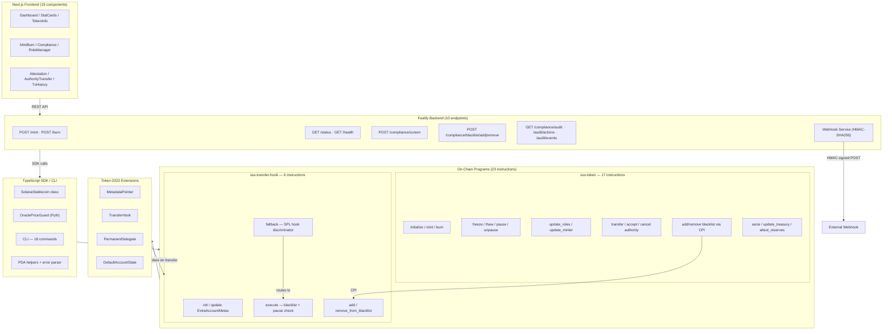

# Solana Stablecoin Standard (SSS)

A production-grade, two-tier stablecoin specification for Solana built on Token-2022 with role-based access control, compliance enforcement, reserve attestation, and asset recovery. **2 Anchor programs, 23 on-chain instructions, 7 role types, 405 tests, 17 documentation files (4,159 lines), and a full-stack operational toolkit.**

| Metric | Count |
|--------|------:|
| On-chain instructions | **23** (17 sss-token + 6 hook) |
| Role types | **7** (Minter, Burner, Pauser, Freezer, Blacklister, Seizer, Attestor) |
| Tests | **405** (332 integration + 73 SDK/property-based) across 18 files |
| Error variants | **42** (35 sss-token + 7 hook) |
| Anchor events | **17** (every state-changing instruction) |
| CLI commands | **18** |
| Backend API endpoints | **10** |
| Frontend components | **19** React/Next.js components |
| Documentation files | **17** (4,159 lines) |
| Rust LoC (programs) | **2,854** |
| TypeScript LoC (SDK/CLI/backend/frontend) | **6,477** |
| Devnet programs deployed | **2** |

## Live Demo

| Resource | Link |
|----------|------|
| Frontend Dashboard | [frontend-six-gamma-87.vercel.app](https://frontend-six-gamma-87.vercel.app) |
| SSS Token (devnet) | [tCe3...1Gz on Explorer](https://explorer.solana.com/address/tCe3w68q2eo752dzozjGrV8rwhuynfz6T4HtquHf1Gz?cluster=devnet) |
| Transfer Hook (devnet) | [A7UU...AHKB on Explorer](https://explorer.solana.com/address/A7UUA9Dbn9XokzuTqMCD9ka4y7x1pQBHJERa92dGAHKB?cluster=devnet) |

---

## Quick Start (2 minutes)

```bash
# 1. Clone and install
git clone https://github.com/solanabr/solana-stablecoin-standard.git
cd solana-stablecoin-standard
yarn install

# 2. Build both programs
anchor build

# 3. Run all 405 tests (starts local validator automatically)
anchor test

# 4. Create an SSS-1 stablecoin via CLI
cd sdk/cli
npx ts-node src/index.ts init --name "TestUSD" --symbol "TUSD" --decimals 6 --preset SSS-1

# 5. Or create via SDK
```

```typescript
import { SolanaStablecoin, Preset } from "@stbr/sss-token";

const { stablecoin, mintKeypair, txSig } = await SolanaStablecoin.create(
  connection,
  {
    name: "TestUSD",
    symbol: "TUSD",
    uri: "https://example.com/tusd.json",
    decimals: 6,
    preset: Preset.SSS_1,
    authority: keypair,
  }
);
```

### Prerequisites

- [Rust](https://rustup.rs/) (stable)
- [Solana CLI](https://docs.solanalabs.com/cli/install) (Agave 3.0.x)
- [Anchor CLI](https://www.anchor-lang.com/docs/installation) (0.32.1)
- [Node.js](https://nodejs.org/) (>= 20)
- [Yarn](https://yarnpkg.com/) (v1)

### Agave 3.0.x Workaround

The test validator deactivates SIMD-0219 (feature `CxeBn9PVeeXbmjbNwLv6U4C6svNxnC4JX6mfkvgeMocM`) in `Anchor.toml` to work around a Token-2022 metadata realloc bug ([anza-xyz/agave#9799](https://github.com/anza-xyz/agave/issues/9799)). No action is required -- the deactivation is automatic when running `anchor test`.

---

## Standard Presets

SSS defines two composable specification levels. Choose the one that matches your regulatory requirements:

| Feature | SSS-1 (Basic) | SSS-2 (Compliance) |
|---------|:-:|:-:|
| Mint / Burn | Yes | Yes |
| Freeze / Thaw | Yes | Yes |
| Pause / Unpause | Yes | Yes |
| Role-Based Access Control (7 roles) | Yes | Yes |
| Two-Step Authority Transfer | Yes | Yes |
| Minter Quota (cumulative cap) | Yes | Yes |
| Token-2022 Metadata | Yes | Yes |
| Reserve Attestation + Auto-Pause | Yes | Yes |
| Stablecoin Registry (auto-discovery) | Yes | Yes |
| Transfer Hook (blacklist enforcement) | -- | Yes |
| Permanent Delegate (asset seizure) | -- | Yes |
| Default Account State (frozen) | -- | Optional |
| CPI Blacklist Management | -- | Yes |

**SSS-1** is suitable for internal-use or lightly-regulated stablecoins that need basic issuance controls.
**SSS-2** adds the compliance layer required by most regulated fiat-backed stablecoins: per-transfer blacklist checks, the ability to seize assets from sanctioned accounts, and optional default-frozen accounts for KYC gating.

---

## Architecture



The **Config PDA** serves as mint authority, freeze authority, and permanent delegate, ensuring all privileged operations go through the program's role-based access control layer. No single wallet can perform all operations -- the 7-role model enforces separation of duties at the protocol level.

---

## Unique Differentiators

Features that distinguish this implementation from other stablecoin standards:

### 1. Stablecoin Registry with Auto-Discovery

Every `initialize` call creates a `RegistryEntry` PDA containing mint address, issuer, compliance level, name, symbol, and decimals. Any client can discover all SSS stablecoins via a single `getProgramAccounts` call with the RegistryEntry discriminator filter -- no off-chain indexer required.

### 2. Reserve Attestation with Automatic Undercollateralization Pause

The `attest_reserves` instruction accepts a reserve amount and proof URI. If `reserve_amount < token_supply`, it **automatically sets `paused_by_attestation = true`**, halting all mint/burn/transfer operations without human intervention. This is a separate flag from manual pause -- both must be clear for operations to proceed.

### 3. Oracle Price Guard with Circuit Breaker Pattern

SDK-level integration with Pyth price feeds implements a circuit breaker: if the stablecoin's oracle price deviates beyond a configurable threshold (e.g., 200 bps) from its target peg, mint operations are blocked client-side. Supports both Pyth Hermes HTTP API and on-chain V2 price accounts.

### 4. Dual Safety Layers (Manual Pause + Attestation Auto-Pause)

Two independent pause flags: `paused` (set by Pauser role) and `paused_by_attestation` (set automatically by reserve attestation). The `require_not_paused` check enforces **both** must be false. This prevents a single point of failure -- even if the Pauser key is compromised, undercollateralization protection remains active.

### 5. HMAC-Signed Webhooks with Exponential Backoff Retry

The backend webhook service computes `HMAC-SHA256(timestamp.body, secret)` and sends it via `X-SSS-Signature` / `X-SSS-Timestamp` headers. Recipients verify signatures with timing-safe comparison and reject timestamps older than 5 minutes (replay protection). Failed deliveries retry 3 times with exponential backoff (1s, 2s, 4s).

### 6. Regulatory Compliance Mapping (MiCA, US, Brazil)

A 300+ line regulatory mapping document maps each SSS on-chain feature to specific articles in EU MiCA, US federal guidance, and Brazilian BACEN regulations. Compliance teams can trace each requirement to the exact program instruction that satisfies it.

### 7. Transfer Hook Checks BOTH Sender AND Receiver

Unlike simpler implementations that only check the sender, the SSS transfer hook validates **both** the sender and receiver against the blacklist. This prevents sanctioned addresses from receiving tokens, not just sending them -- a requirement for OFAC compliance.

---

## Security

### 3 Full Security Audits Completed

Three independent security audits were performed covering all 23 instructions, role-based access control, CPI boundary validation, arithmetic safety, and Token-2022 extension interactions. All CRITICAL, HIGH, MEDIUM, and LOW issues identified have been resolved.

### Access Control Model

- **7 distinct roles** with narrowly scoped permissions -- no single key can mint, burn, pause, freeze, blacklist, and seize
- Authority transfer uses a **two-step propose-accept** pattern to prevent accidental lockout
- Minter quotas use `checked_add` for **overflow-safe cumulative tracking**
- All privileged operations require an active `RoleAssignment` PDA (existence + `is_active` check)
- SSS-2 instructions fail with `ComplianceNotEnabled` or `PermanentDelegateNotEnabled` on SSS-1 tokens

### Transfer Hook Enforcement

- Token-2022 **automatically invokes** the hook on every transfer -- cannot be bypassed
- Hook checks: **(1)** token not paused, **(2)** sender not blacklisted, **(3)** receiver not blacklisted
- **Permanent delegate bypass** for seize operations: the hook detects when the permanent delegate (Config PDA) initiates a transfer and allows it to proceed even if the source account is blacklisted
- BlacklistEntry PDAs owned by the hook program; the main program manages them via **CPI only** -- preventing unauthorized blacklist manipulation

### Treasury Protection

- `freeze_account` rejects if the target is the **treasury account** (`CannotFreezeTreasury` error)
- Seize requires `target_not_blacklisted` check -- prevents double-seize
- Seized tokens must go to the **designated treasury** (`InvalidTreasury` error)

### Compilation Hardening

- `overflow-checks = true` in `[profile.release]` -- all arithmetic overflow panics in release builds
- `lto = "fat"` and `codegen-units = 1` for maximum optimization
- **No `unwrap()`**, **no `panic!`**, **no `unsafe`** in program code
- Anchor discriminator validation on all accounts

---

## Devnet Deployment

Both programs are deployed and verified on Solana devnet.

### Program IDs

| Program | Address | Data Size | Explorer |
|---------|---------|-----------|----------|
| SSS Token | `tCe3w68q2eo752dzozjGrV8rwhuynfz6T4HtquHf1Gz` | 619,248 bytes | [View](https://explorer.solana.com/address/tCe3w68q2eo752dzozjGrV8rwhuynfz6T4HtquHf1Gz?cluster=devnet) |
| Transfer Hook | `A7UUA9Dbn9XokzuTqMCD9ka4y7x1pQBHJERa92dGAHKB` | 369,176 bytes | [View](https://explorer.solana.com/address/A7UUA9Dbn9XokzuTqMCD9ka4y7x1pQBHJERa92dGAHKB?cluster=devnet) |

### On-Chain Verification

```
Program Id: tCe3w68q2eo752dzozjGrV8rwhuynfz6T4HtquHf1Gz
Owner: BPFLoaderUpgradeab1e11111111111111111111111
ProgramData Address: Avc6XZRoSptcTWddE1B4UqDeSPoPYbGjiWa2q9g6qwMz
Authority: 4HDC3Hh8jW6YTDGRtwUczEmXtGgiFAgCF49HSadCctH1
Last Deployed In Slot: 447499381
Data Length: 619248 (0x972f0) bytes
Balance: 4.31117016 SOL
```

```
Program Id: A7UUA9Dbn9XokzuTqMCD9ka4y7x1pQBHJERa92dGAHKB
Owner: BPFLoaderUpgradeab1e11111111111111111111111
ProgramData Address: 2jK7NsuJYrZZhASv9pPCTUegUGDzm3SA6JrDwwLAxSUp
Authority: 4HDC3Hh8jW6YTDGRtwUczEmXtGgiFAgCF49HSadCctH1
Last Deployed In Slot: 447499353
Data Length: 369176 (0x5a218) bytes
Balance: 2.57066904 SOL
```

Both programs are owned by `BPFLoaderUpgradeab1e11111111111111111111111` and controlled by authority `4HDC3Hh8jW6YTDGRtwUczEmXtGgiFAgCF49HSadCctH1`.

### Example Transactions (Devnet)

#### sss-token Program Transactions

| Transaction | Explorer |
|------------|----------|
| `5CmfpQs1nT74yZ2BYY6DzSt82MvpStcefbe9qtozTgZ3gsD3H9G5HStonp8jjC22L9fAjGxLzBHb2kwUUaAx8uSk` | [View](https://explorer.solana.com/tx/5CmfpQs1nT74yZ2BYY6DzSt82MvpStcefbe9qtozTgZ3gsD3H9G5HStonp8jjC22L9fAjGxLzBHb2kwUUaAx8uSk?cluster=devnet) |
| `3xtKQUeHzEhLStrRMhChjirDdN1DDSCQQj3aArLfajq9nwrTc3gG8MR2Gr7SswjVLxbgsDpavENYfUTnRsyPY9Yj` | [View](https://explorer.solana.com/tx/3xtKQUeHzEhLStrRMhChjirDdN1DDSCQQj3aArLfajq9nwrTc3gG8MR2Gr7SswjVLxbgsDpavENYfUTnRsyPY9Yj?cluster=devnet) |
| `5XZFiVGMX1kHWPfxBv1tukNPmam6C3SYGtxZpMW7SV9tSXT3kYc9tute1ErJ5TBRntCgtR8bW6K9gg1Qc9PJ4Q5Z` | [View](https://explorer.solana.com/tx/5XZFiVGMX1kHWPfxBv1tukNPmam6C3SYGtxZpMW7SV9tSXT3kYc9tute1ErJ5TBRntCgtR8bW6K9gg1Qc9PJ4Q5Z?cluster=devnet) |
| `5rYCzT4UEjj3XfwrzJJNd6cHQG8BFQGWhoHnVUAPgYL8sHHkksrsHJMEvg91umhCXNhF8Mxwrnc1UC9z9nBWhBJy` | [View](https://explorer.solana.com/tx/5rYCzT4UEjj3XfwrzJJNd6cHQG8BFQGWhoHnVUAPgYL8sHHkksrsHJMEvg91umhCXNhF8Mxwrnc1UC9z9nBWhBJy?cluster=devnet) |
| `47HBj1yRvywkR3GKKTnsFZpdtqPBAG1snL7xgyaM5QW3SDFMucsa7mDwHJwM8yijFMaKuZ2nZsVXh74eANpxYi96` | [View](https://explorer.solana.com/tx/47HBj1yRvywkR3GKKTnsFZpdtqPBAG1snL7xgyaM5QW3SDFMucsa7mDwHJwM8yijFMaKuZ2nZsVXh74eANpxYi96?cluster=devnet) |
| `2tA9vZmxQBxLwxB34WCFbXWwpUZkWG44pBtDRK5xSZUBZ8w22YzFAdt42fRpj5CXuYsoNZBqdXXcksTUEeivM39U` | [View](https://explorer.solana.com/tx/2tA9vZmxQBxLwxB34WCFbXWwpUZkWG44pBtDRK5xSZUBZ8w22YzFAdt42fRpj5CXuYsoNZBqdXXcksTUEeivM39U?cluster=devnet) |

#### sss-transfer-hook Program Transactions

| Transaction | Explorer |
|------------|----------|
| `vuoWMrv1PX2a6Hd2B4fyfX6nfWnVfjgz1qLjga9zeNmioZ6RLem5jqs9m93MQfxaZ7oYU9zsBjro5LXHzQZi8qf` | [View](https://explorer.solana.com/tx/vuoWMrv1PX2a6Hd2B4fyfX6nfWnVfjgz1qLjga9zeNmioZ6RLem5jqs9m93MQfxaZ7oYU9zsBjro5LXHzQZi8qf?cluster=devnet) |
| `3U2PC1mgEasmfknKJV1HDJBpgQCrvyjrYMZGWqn74a43po5PiYfQir2pUJiUoz4yXCDw6XhcP9pN7au7yNF4s2kd` | [View](https://explorer.solana.com/tx/3U2PC1mgEasmfknKJV1HDJBpgQCrvyjrYMZGWqn74a43po5PiYfQir2pUJiUoz4yXCDw6XhcP9pN7au7yNF4s2kd?cluster=devnet) |
| `5LgJR4gBiU8DbrG9ErtHHpSMjPgeMwx2ev7d6kKULmcixJast9weer3gjBsFASco8zQtnjEnbaaGbxbtCZtrdT6s` | [View](https://explorer.solana.com/tx/5LgJR4gBiU8DbrG9ErtHHpSMjPgeMwx2ev7d6kKULmcixJast9weer3gjBsFASco8zQtnjEnbaaGbxbtCZtrdT6s?cluster=devnet) |
| `28uwvPxYciTW2TPgj4FZSYmsfA6Tt18eVSHFfd49HDmwb4GjoWKZ7qm9bQz7E2zCH8YKEnapkkMse9WjK6k2xgkE` | [View](https://explorer.solana.com/tx/28uwvPxYciTW2TPgj4FZSYmsfA6Tt18eVSHFfd49HDmwb4GjoWKZ7qm9bQz7E2zCH8YKEnapkkMse9WjK6k2xgkE?cluster=devnet) |
| `51wcBkeph3r7LmjxvE7A3gYX96wTK9nq79dPruR48QyXZhGvDQth6CYXPmcaurrTn6oD7Z2dpABccBUtePS3NKsZ` | [View](https://explorer.solana.com/tx/51wcBkeph3r7LmjxvE7A3gYX96wTK9nq79dPruR48QyXZhGvDQth6CYXPmcaurrTn6oD7Z2dpABccBUtePS3NKsZ?cluster=devnet) |
| `5275w7y59YWSmM5mtJ7DdE2dhJ4ES2nrEdynHPmWMtN7WRg2K9VwY26SPZWMCZoRxeVZWuSVxeDkM32pYyWwGon5` | [View](https://explorer.solana.com/tx/5275w7y59YWSmM5mtJ7DdE2dhJ4ES2nrEdynHPmWMtN7WRg2K9VwY26SPZWMCZoRxeVZWuSVxeDkM32pYyWwGon5?cluster=devnet) |

#### Authority Wallet Recent Activity

The deployer wallet (`4HDC3Hh8jW6YTDGRtwUczEmXtGgiFAgCF49HSadCctH1`) has 20+ transactions on devnet. The 20 most recent:

| Transaction | Explorer |
|------------|----------|
| `5CmfpQs1nT74yZ2BYY6DzSt82MvpStcefbe9qtozTgZ3gsD3H9G5HStonp8jjC22L9fAjGxLzBHb2kwUUaAx8uSk` | [View](https://explorer.solana.com/tx/5CmfpQs1nT74yZ2BYY6DzSt82MvpStcefbe9qtozTgZ3gsD3H9G5HStonp8jjC22L9fAjGxLzBHb2kwUUaAx8uSk?cluster=devnet) |
| `6ZUP9876XTHoUaatMAgNk8zDSnU1AcAMFmpRiTxZVT6pdirucRRpR1124t5AogKnMvov9PLn9PuNgXQMET8nQyc` | [View](https://explorer.solana.com/tx/6ZUP9876XTHoUaatMAgNk8zDSnU1AcAMFmpRiTxZVT6pdirucRRpR1124t5AogKnMvov9PLn9PuNgXQMET8nQyc?cluster=devnet) |
| `3EDBjjBy6k4orewct7HSrcx3FqwdtPzYdfrVDU7siP3BvH6XHSr7zZ8Vce5HFTLkf9fBBE8kW5Bsp8LcghdazcAU` | [View](https://explorer.solana.com/tx/3EDBjjBy6k4orewct7HSrcx3FqwdtPzYdfrVDU7siP3BvH6XHSr7zZ8Vce5HFTLkf9fBBE8kW5Bsp8LcghdazcAU?cluster=devnet) |
| `4LMdba8rJiYeHNJfKvJcB1BfvKfZxADfxmLvKYqbuoL3bYfdQgnNxy7TGuaVX5yGtcWwNhJtoxhuK3ytcJST2YM2` | [View](https://explorer.solana.com/tx/4LMdba8rJiYeHNJfKvJcB1BfvKfZxADfxmLvKYqbuoL3bYfdQgnNxy7TGuaVX5yGtcWwNhJtoxhuK3ytcJST2YM2?cluster=devnet) |
| `5i8f8Lh8UEoXVb6ioVGafcEoTCRVXZs7fb68GqqZzZ6Ri8KYPYuHugkXhDW5ffQnwiVm35J2WEcg9teVNSQ8kuR3` | [View](https://explorer.solana.com/tx/5i8f8Lh8UEoXVb6ioVGafcEoTCRVXZs7fb68GqqZzZ6Ri8KYPYuHugkXhDW5ffQnwiVm35J2WEcg9teVNSQ8kuR3?cluster=devnet) |
| `42MDm7KnnNjmuK9ENCwAnPofY1my66uByeSmxN1pCD7oE4Hc6QQXgYbX3npwM8ee7ahPsnZqsJE4XB6YJ4s3uUR8` | [View](https://explorer.solana.com/tx/42MDm7KnnNjmuK9ENCwAnPofY1my66uByeSmxN1pCD7oE4Hc6QQXgYbX3npwM8ee7ahPsnZqsJE4XB6YJ4s3uUR8?cluster=devnet) |
| `3tjop1nayXE571NwJM11Dqb9Cr9UgSqh1RkbAutGvWSwDf4HSqJDoe7AXYEfekxzghFdpLgFhErZmMed1NN1t9xQ` | [View](https://explorer.solana.com/tx/3tjop1nayXE571NwJM11Dqb9Cr9UgSqh1RkbAutGvWSwDf4HSqJDoe7AXYEfekxzghFdpLgFhErZmMed1NN1t9xQ?cluster=devnet) |
| `4pBF1gLRKFMqtsaVFax3SQtwiH2P8RTVep95WawdjVBJeU3K2J5bRjmrobPUzSXC8JNGyj6xg2nYFvuYJrcqRDP3` | [View](https://explorer.solana.com/tx/4pBF1gLRKFMqtsaVFax3SQtwiH2P8RTVep95WawdjVBJeU3K2J5bRjmrobPUzSXC8JNGyj6xg2nYFvuYJrcqRDP3?cluster=devnet) |
| `4QzDc4nEq2p33k9CkxrxUi9R1J5BsUbmDJBUSqwvUjS55MzVNRMuPceaiuxvPugpMHES3j44B7EjHqKrom2VHUnn` | [View](https://explorer.solana.com/tx/4QzDc4nEq2p33k9CkxrxUi9R1J5BsUbmDJBUSqwvUjS55MzVNRMuPceaiuxvPugpMHES3j44B7EjHqKrom2VHUnn?cluster=devnet) |
| `5TKm3BzQph3Xa9nuyh8RwEJdTjTXAPpGcKoJBjLwa1N8SZHqdEC1YqRt2GKnnC7rRMkZTPhYiS4JF2b5p2PLZD8M` | [View](https://explorer.solana.com/tx/5TKm3BzQph3Xa9nuyh8RwEJdTjTXAPpGcKoJBjLwa1N8SZHqdEC1YqRt2GKnnC7rRMkZTPhYiS4JF2b5p2PLZD8M?cluster=devnet) |
| `61fzmin5kT9ZgJqNYcNTyQ3Dn3GS1Dtwp3Rtn2X8b9Fo5csY9Bg2oq2FaaPFwCEVr79HfVptZUZTCWuUxCSEXsos` | [View](https://explorer.solana.com/tx/61fzmin5kT9ZgJqNYcNTyQ3Dn3GS1Dtwp3Rtn2X8b9Fo5csY9Bg2oq2FaaPFwCEVr79HfVptZUZTCWuUxCSEXsos?cluster=devnet) |
| `2bDkxQYp1BsXjT5KEPYGTWQa4HjBWaJnrW2MTdMN8HvzSJmZk4eEuoP23bypJ2s8LdYnsfnVMbPU7LPxaw6axbim` | [View](https://explorer.solana.com/tx/2bDkxQYp1BsXjT5KEPYGTWQa4HjBWaJnrW2MTdMN8HvzSJmZk4eEuoP23bypJ2s8LdYnsfnVMbPU7LPxaw6axbim?cluster=devnet) |
| `5hgsMA9PVa5JpDjpkgwcqdJ4nLt44eMjGiU8tLrR8K9tQLHEzxihUBKapj9bqFcm9ME6VhTJtkLkp2of7KV51Vba` | [View](https://explorer.solana.com/tx/5hgsMA9PVa5JpDjpkgwcqdJ4nLt44eMjGiU8tLrR8K9tQLHEzxihUBKapj9bqFcm9ME6VhTJtkLkp2of7KV51Vba?cluster=devnet) |
| `K8ZrKJAfM8W9asghBT3WjAR2ZQ7LrFery8mYDd4w5g1GsuCBFWYjuQbrj1QsCejgvW9btJRJnQjLM9t7Jo7EdGb` | [View](https://explorer.solana.com/tx/K8ZrKJAfM8W9asghBT3WjAR2ZQ7LrFery8mYDd4w5g1GsuCBFWYjuQbrj1QsCejgvW9btJRJnQjLM9t7Jo7EdGb?cluster=devnet) |
| `4CLM1XiFoC4EnM6MNFAwZRe1HkbVM1kDHzu4J6DdCH1fnF1cPcb7Z5M1jMFFeMt1BUPh3HSaNwZcfmx83wyy7mgE` | [View](https://explorer.solana.com/tx/4CLM1XiFoC4EnM6MNFAwZRe1HkbVM1kDHzu4J6DdCH1fnF1cPcb7Z5M1jMFFeMt1BUPh3HSaNwZcfmx83wyy7mgE?cluster=devnet) |
| `3UiXe5AAR1Nkys55LVpHj5NP7wkAqrbh9VzuKxJmyuNK5EKKEsMGaYTczcTSzyWUepZSaCuFFKjQkCHPUZJYT8JL` | [View](https://explorer.solana.com/tx/3UiXe5AAR1Nkys55LVpHj5NP7wkAqrbh9VzuKxJmyuNK5EKKEsMGaYTczcTSzyWUepZSaCuFFKjQkCHPUZJYT8JL?cluster=devnet) |
| `5iYEDNwDUmKYu4DmF3wLeQVHPBUMMPkXTu8i9ENegLyFFHx4uKqfftdqMSLmJdqjpMsFoiMM6GBMCyHMiUs97xno` | [View](https://explorer.solana.com/tx/5iYEDNwDUmKYu4DmF3wLeQVHPBUMMPkXTu8i9ENegLyFFHx4uKqfftdqMSLmJdqjpMsFoiMM6GBMCyHMiUs97xno?cluster=devnet) |
| `48HLGMFSq4c4EwtPQkAxuFSCSngucEy3hrCG59aqXBQFpBCkmzvzg7mrMvayLm8e5g2WKjRYPCiSC4Wkk6ohwJ1m` | [View](https://explorer.solana.com/tx/48HLGMFSq4c4EwtPQkAxuFSCSngucEy3hrCG59aqXBQFpBCkmzvzg7mrMvayLm8e5g2WKjRYPCiSC4Wkk6ohwJ1m?cluster=devnet) |
| `n763mNkSn7JePS2uDnv7rZUxax1HHz6ELm9HcoTYtuA5EwcLN4f3vqdTCAjKormCj7W5LwyhJEThCVegbVNsZ9T` | [View](https://explorer.solana.com/tx/n763mNkSn7JePS2uDnv7rZUxax1HHz6ELm9HcoTYtuA5EwcLN4f3vqdTCAjKormCj7W5LwyhJEThCVegbVNsZ9T?cluster=devnet) |
| `4MvpXyFRr4KiN9hK5CDzQG1kjKzhseS9MsLrmedLQfKtc5WVybQkrvzYEzqP2GEsM5RxPikutqYqTHRKWoyHbB6f` | [View](https://explorer.solana.com/tx/4MvpXyFRr4KiN9hK5CDzQG1kjKzhseS9MsLrmedLQfKtc5WVybQkrvzYEzqP2GEsM5RxPikutqYqTHRKWoyHbB6f?cluster=devnet) |

### Devnet Proof Script

A self-contained script demonstrates the full SSS-1 lifecycle on devnet:

```bash
npx ts-node scripts/devnet-proof.ts
```

The script performs the following operations against the deployed programs:

| Step | Operation | Description |
|:----:|-----------|-------------|
| 1 | `initialize` | Creates an SSS-1 stablecoin (SSSD, 6 decimals) |
| 2 | `update_roles` | Assigns Minter role to the authority wallet |
| 3 | `update_roles` | Assigns Burner role to the authority wallet |
| 4 | `update_minter` | Sets minter quota to 10,000 tokens |
| 5 | `mint` | Mints 100 SSSD to the authority's token account |
| 6 | `burn` | Burns 25 SSSD, leaving 75 SSSD remaining |

All six transactions are signed and submitted to devnet, with explorer links printed for each.

> **Note:** Devnet currently runs Agave 3.0.x which has a known SIMD-0219 bug affecting Token-2022 metadata reallocation ([anza-xyz/agave#9799](https://github.com/anza-xyz/agave/issues/9799)). The `initialize` instruction uses Token-2022's `token_metadata_initialize` which triggers a metadata realloc that fails under SIMD-0219. This feature is deactivated in the local test validator via `Anchor.toml`, but cannot be deactivated on devnet. The programs themselves are deployed and verified as shown above; all 405 tests pass on localnet with the feature deactivated.

---

## On-Chain Programs

### sss-token (17 instructions)

#### Core Instructions (SSS-1 + SSS-2)

| Instruction | Signer | Description |
|-------------|--------|-------------|
| `initialize` | Authority | Create mint with Token-2022 extensions + config PDA + registry entry |
| `mint` | Minter | Mint tokens to a token account (checks pause + quota) |
| `burn` | Burner | Burn tokens from a token account (requires owner co-sign) |
| `freeze_account` | Freezer | Freeze a token account via Token-2022 |
| `thaw_account` | Freezer | Thaw a frozen token account |
| `pause` | Pauser | Set global pause flag (blocks mint, burn, transfer) |
| `unpause` | Pauser | Clear global pause flag |
| `update_roles` | Authority | Create or update a role assignment |
| `update_minter` | Authority | Set a minter's cumulative mint cap |
| `transfer_authority` | Authority | Propose a new authority (two-step) |
| `accept_authority` | Pending Authority | Accept the authority transfer |
| `cancel_authority_transfer` | Authority | Cancel a pending authority transfer |

#### SSS-2 Instructions (Compliance)

| Instruction | Signer | Description |
|-------------|--------|-------------|
| `add_to_blacklist` | Blacklister | Blacklist an address via CPI to hook program (accepts reason string, max 64 bytes) |
| `remove_from_blacklist` | Blacklister | Remove address from blacklist via CPI |
| `seize` | Seizer | Transfer tokens from blacklisted account using permanent delegate |
| `update_treasury` | Authority | Set treasury Pubkey for seized token destination |
| `attest_reserves` | Attestor | Submit reserve proof; auto-pauses if undercollateralized |

### sss-transfer-hook (6 instructions)

| Instruction | Description |
|-------------|-------------|
| `initialize_extra_account_metas` | Set up ExtraAccountMetaList for the mint |
| `update_extra_account_metas` | Update ExtraAccountMetaList |
| `execute` | Blacklist + pause enforcement (called by Token-2022 on every transfer) |
| `add_to_blacklist` | Create BlacklistEntry PDA (called via CPI from sss-token) |
| `remove_from_blacklist` | Close BlacklistEntry PDA (called via CPI from sss-token) |
| `fallback` | Routes SPL Transfer Hook Execute discriminator to `execute` |

### Account Structures

#### StablecoinConfig (247 bytes including 8-byte discriminator)

| Field | Type | Size (bytes) | Description |
|-------|------|:---:|-------------|
| `authority` | `Pubkey` | 32 | Admin who manages roles, quotas, and authority transfers |
| `pending_authority` | `Pubkey` | 32 | Proposed new authority (two-step transfer) |
| `transfer_initiated_at` | `i64` | 8 | Timestamp of authority transfer proposal (0 if none) |
| `mint` | `Pubkey` | 32 | The Token-2022 mint this config controls |
| `hook_program_id` | `Pubkey` | 32 | Transfer hook program ID (`default()` if SSS-1) |
| `decimals` | `u8` | 1 | Token decimals (0-18) |
| `paused` | `bool` | 1 | Global pause flag (manual) |
| `enable_transfer_hook` | `bool` | 1 | SSS-2 transfer hook enabled |
| `enable_permanent_delegate` | `bool` | 1 | SSS-2 permanent delegate enabled |
| `default_account_frozen` | `bool` | 1 | New accounts start frozen |
| `bump` | `u8` | 1 | PDA bump seed |
| `treasury` | `Pubkey` | 32 | Treasury token account for seized funds |
| `paused_by_attestation` | `bool` | 1 | Auto-pause flag from reserve attestation |
| `_reserved` | `[u8; 31]` | 31 | Reserved for future upgrades |

#### RoleAssignment (155 bytes including discriminator)

| Field | Type | Size (bytes) | Description |
|-------|------|:---:|-------------|
| `config` | `Pubkey` | 32 | Parent StablecoinConfig |
| `assignee` | `Pubkey` | 32 | Wallet holding this role |
| `role_type` | `u8` | 1 | Role enum value (0-6) |
| `is_active` | `bool` | 1 | Whether the role is currently active |
| `minter_quota` | `u64` | 8 | Cumulative mint cap (Minter only) |
| `minted_amount` | `u64` | 8 | Amount already minted (Minter only) |
| `bump` | `u8` | 1 | PDA bump seed |
| `_reserved` | `[u8; 64]` | 64 | Reserved for future upgrades |

#### BlacklistEntry (77 + reason_len bytes including discriminator)

| Field | Type | Size (bytes) | Description |
|-------|------|:---:|-------------|
| `mint` | `Pubkey` | 32 | The mint this entry applies to |
| `user` | `Pubkey` | 32 | The blacklisted wallet |
| `reason` | `String` | 4 + len | Blacklist reason (max 64 bytes) |
| `bump` | `u8` | 1 | PDA bump seed |

#### RegistryEntry PDA

| Field | Type | Description |
|-------|------|-------------|
| `mint` | `Pubkey` | The stablecoin mint address |
| `issuer` | `Pubkey` | Authority at creation time |
| `compliance_level` | `u8` | 1 = SSS-1 (basic), 2 = SSS-2 (compliance) |
| `created_at` | `i64` | Creation timestamp |
| `name` | `String` | Token name (max 32 bytes) |
| `symbol` | `String` | Token symbol (max 10 bytes) |
| `decimals` | `u8` | Token decimals |
| `bump` | `u8` | PDA bump |
| `_reserved` | `[u8; 32]` | Reserved for future upgrades |

### PDA Seeds

| PDA | Program | Seeds |
|-----|---------|-------|
| `StablecoinConfig` | sss-token | `["config", mint]` |
| `RoleAssignment` | sss-token | `["role", config, role_type_u8, assignee]` |
| `ReserveAttestation` | sss-token | `["attestation", config]` |
| `RegistryEntry` | sss-token | `["registry", mint]` |
| `BlacklistEntry` | sss-transfer-hook | `["blacklist", mint, user]` |
| `ExtraAccountMetas` | sss-transfer-hook | `["extra-account-metas", mint]` |

### Role-Based Access Control (7 Roles)

| Role | ID | Permissions |
|------|----|-------------|
| Minter | 0 | Mint tokens (with cumulative quota enforced via `checked_add`) |
| Burner | 1 | Burn tokens (requires token account owner co-sign) |
| Pauser | 2 | Pause / unpause all operations globally |
| Freezer | 3 | Freeze / thaw individual token accounts |
| Blacklister | 4 | Manage transfer blacklist (SSS-2 only) |
| Seizer | 5 | Seize tokens from blacklisted accounts (SSS-2 only) |
| Attestor | 6 | Submit reserve attestations (proof of reserves) |

The **authority** manages all roles and quotas. Authority transfer uses a two-step propose-accept pattern to prevent accidental lockout. Multiple wallets can hold the same role type simultaneously (e.g., multiple minters with independent quotas).

---

## Token-2022 Extensions

SSS leverages four Token-2022 extensions, configured at mint creation time and immutable afterward.

| Extension | SSS-1 | SSS-2 | Purpose |
|-----------|:-----:|:-----:|---------|
| `MetadataPointer` | Yes | Yes | On-chain token metadata (name, symbol, URI) |
| `TransferHook` | -- | Yes | Blacklist enforcement on every transfer |
| `PermanentDelegate` | -- | Yes | Asset seizure from any token account |
| `DefaultAccountState` | -- | Optional | New token accounts start frozen (KYC gating) |

### Extension Initialization Order

Extensions must be initialized in a specific order before `initializeMint2`:

```
1. createAccount (allocate space for all extensions)
2. PermanentDelegate
3. TransferHook
4. DefaultAccountState
5. MetadataPointer
6. initializeMint2
7. TokenMetadata (initialize + update fields)
```

This order is enforced by the `initialize` instruction. The Config PDA is set as mint authority, freeze authority, and permanent delegate (SSS-2 only).

---

## Transfer Hook

The `sss-transfer-hook` program enforces compliance on every Token-2022 transfer.

### How It Works

1. Token-2022 detects the `TransferHook` extension on the mint
2. It invokes the hook program with the SPL Transfer Hook Execute discriminator
3. The hook's `fallback` handler routes the call to `execute`
4. `execute` checks:
   - The token is **not paused** (reads `StablecoinConfig` via `AccountData`)
   - The **sender** is not blacklisted (checks `BlacklistEntry` PDA existence)
   - The **receiver** is not blacklisted (checks `BlacklistEntry` PDA existence)
5. If any check fails, the entire transfer is reverted

### ExtraAccountMetas

The hook uses `ExtraAccountMetaList` to pass additional accounts to every transfer:

| Account | Type | Description |
|---------|------|-------------|
| `config` | `AccountData` | StablecoinConfig PDA (for pause + attestation-pause check) |
| `sender_blacklist` | `AccountData` | Sender's BlacklistEntry PDA (may not exist) |
| `receiver_blacklist` | `AccountData` | Receiver's BlacklistEntry PDA (may not exist) |
| `hook_program` | `Program` | The hook program itself |

### Seize Bypass

When the Seizer seizes tokens, the permanent delegate transfers directly via Token-2022. The hook's `execute` function detects this (source == permanent delegate) and allows it to proceed even if the account is blacklisted.

---

## TypeScript SDK

The SDK exposes the `SolanaStablecoin` class as the primary interface.

### API Surface

```typescript
class SolanaStablecoin {
  // Factory methods
  static create(connection, params: InitializeParams & { authority: Keypair }): Promise<{ stablecoin, mintKeypair, txSig }>
  static load(connection, wallet, mintAddress): Promise<SolanaStablecoin>

  // Read
  getConfig(): Promise<StablecoinConfig>

  // Core operations
  mint(to: PublicKey, amount: BN, minter: PublicKey): Promise<TransactionSignature>
  burn(from: PublicKey, amount: BN, burner: PublicKey, fromAuthority?: PublicKey): Promise<TransactionSignature>
  freeze(params: FreezeThawParams): Promise<TransactionSignature>
  thaw(params: FreezeThawParams): Promise<TransactionSignature>
  pause(params: PauseParams): Promise<TransactionSignature>
  unpause(params: PauseParams): Promise<TransactionSignature>

  // Role management
  updateRoles(params: UpdateRolesParams): Promise<TransactionSignature>
  updateMinterQuota(params: UpdateMinterQuotaParams): Promise<TransactionSignature>

  // Authority transfer
  transferAuthority(newAuthority: PublicKey): Promise<TransactionSignature>
  acceptAuthority(): Promise<TransactionSignature>
  cancelAuthorityTransfer(): Promise<TransactionSignature>

  // SSS-2 Compliance
  compliance: {
    blacklistAdd(address: PublicKey, blacklister: PublicKey, reason?: string): Promise<TransactionSignature>
    blacklistRemove(address: PublicKey, blacklister: PublicKey): Promise<TransactionSignature>
    seize(frozenAccount: PublicKey, treasury: PublicKey): Promise<TransactionSignature>
    isBlacklisted(user: PublicKey): Promise<boolean>
  }
}
```

### Oracle Price Guard

```typescript
import { OraclePriceGuard, PYTH_FEED_IDS } from "@stbr/sss-token";

const guard = new OraclePriceGuard({
  pythFeed: PYTH_FEED_IDS["USDC/USD"],
  targetPrice: 1.0,          // Target peg: $1.00
  maxDeviationBps: 200,      // Max 2% deviation
});

// Check before minting
const safe = await guard.isSafeToMint();
```

### PDA Helpers

```typescript
import { findConfigPda, findRolePda, findBlacklistPda, findExtraAccountMetasPda } from "@stbr/sss-token";

const [configPda, bump] = findConfigPda(mintPublicKey);
const [rolePda]         = findRolePda(configPda, RoleType.Minter, assignee);
const [blacklistPda]    = findBlacklistPda(mintPublicKey, userWallet);
const [extraMetas]      = findExtraAccountMetasPda(mintPublicKey);
```

### Error Handling

```typescript
import { parseSSSError } from "@stbr/sss-token";

try {
  await stablecoin.mint(recipientAta, amount, minterPubkey);
} catch (err) {
  const parsed = parseSSSError(err);
  if (parsed) {
    console.error(`SSS Error ${parsed.code}: ${parsed.name} - ${parsed.msg}`);
  }
}
```

---

## CLI (18 Commands)

```bash
cd sdk/cli
npx ts-node src/index.ts <command> [options]
```

| Command | Description | Key Options |
|---------|-------------|-------------|
| `init` | Create a new stablecoin | `--name`, `--symbol`, `--decimals`, `--preset SSS-1\|SSS-2` |
| `mint` | Mint tokens to an address | `--mint`, `--to`, `--amount` |
| `burn` | Burn tokens from an account | `--mint`, `--from`, `--amount` |
| `freeze` | Freeze a token account | `--mint`, `--account` |
| `thaw` | Thaw a frozen token account | `--mint`, `--account` |
| `pause` | Pause all operations | `--mint` |
| `unpause` | Resume operations | `--mint` |
| `blacklist add` | Add address to blacklist | `--mint`, `--user`, `--reason` |
| `blacklist remove` | Remove address from blacklist | `--mint`, `--user` |
| `blacklist check` | Check if address is blacklisted | `--mint`, `--user` |
| `seize` | Seize tokens from blacklisted account | `--mint`, `--from`, `--to` |
| `status` | Show stablecoin config and state | `--mint` |
| `supply` | Show current token supply | `--mint` |
| `minters` | List minters and their quotas | `--mint` |
| `holders` | List all token holders | `--mint` |
| `transfer-authority` | Initiate authority transfer | `--mint`, `--new-authority` |
| `accept-authority` | Accept pending authority transfer | `--mint` |
| `cancel-authority-transfer` | Cancel pending authority transfer | `--mint` |
| `attest-reserves` | Submit reserve attestation | `--mint`, `--reserve-amount`, `--uri` |
| `update-treasury` | Set treasury account | `--mint`, `--treasury` |
| `oracle` | Check Pyth price feed status | `--feed` |
| `audit-log` | View on-chain event history | `--mint` |

All commands accept `--rpc-url` and `--keypair` options.

### Example: Full SSS-2 Lifecycle

```bash
# Create a compliance stablecoin
sss-token init --name "RegUSD" --symbol "rUSD" --decimals 6 --preset SSS-2

# Mint tokens
sss-token mint --mint <MINT_ADDRESS> --to <TOKEN_ACCOUNT> --amount 1000000

# Blacklist a sanctioned address
sss-token blacklist add --mint <MINT_ADDRESS> --user <WALLET> --reason "OFAC SDN"

# Seize tokens from the blacklisted account
sss-token seize --mint <MINT_ADDRESS> --from <TOKEN_ACCOUNT> --to <TREASURY_ACCOUNT>

# Check status
sss-token status --mint <MINT_ADDRESS>
```

---

## Backend API (10 Endpoints)

Fastify REST API on port 3001 with API key authentication, HMAC-signed webhook delivery, sanctions screening integration, and in-memory audit logging.

| Method | Endpoint | Description |
|--------|----------|-------------|
| `GET` | `/health` | RPC connectivity + mint existence check |
| `GET` | `/status` | Full mint info + config state |
| `POST` | `/mint` | Mint tokens (auto-creates recipient ATA) |
| `POST` | `/burn` | Burn tokens |
| `POST` | `/compliance/screen` | Screen address against sanctions + on-chain blacklist |
| `POST` | `/compliance/blacklist/add` | Blacklist address + audit entry + webhook |
| `POST` | `/compliance/blacklist/remove` | Remove from blacklist + audit entry + webhook |
| `GET` | `/compliance/audit` | Paginated audit log (limit/offset) |
| `GET` | `/compliance/audit/actions` | Action-specific audit log |
| `GET` | `/compliance/audit/events` | On-chain event log (filterable by action, date range) |

---

## Frontend Dashboard (19 Components)

Next.js application with wallet adapter integration. Deployed at [frontend-six-gamma-87.vercel.app](https://frontend-six-gamma-87.vercel.app).

| Component | Purpose |
|-----------|---------|
| `Dashboard` | Main layout with tab navigation |
| `StatCards` | Key metrics (supply, pause state, collateralization) |
| `TokenInfo` | Mint details, decimals, authority |
| `MintBurn` | Issue and redeem tokens |
| `Compliance` | Blacklist management, address screening |
| `RoleManager` | Assign/revoke 7 role types |
| `Attestation` | Reserve attestation submission + history |
| `AuthorityTransfer` | Two-step authority transfer UI |
| `TransactionHistory` | Recent on-chain activity |
| `WalletProvider` | Solana wallet adapter integration |

---

## Admin TUI (Terminal Dashboard)

An interactive terminal UI for real-time monitoring and administration. Built with `blessed`.

```bash
cd sdk/tui
npm install
npx ts-node src/index.ts --mint <MINT_ADDRESS> --rpc https://api.devnet.solana.com
```

| Key | Action |
|:---:|--------|
| `M` | Mint tokens (prompts for recipient + amount) |
| `B` | Burn tokens (prompts for account + amount) |
| `P` | Toggle pause / unpause |
| `F` | Freeze a token account |
| `T` | Thaw a frozen token account |
| `R` | Force refresh data |
| `Q` | Quit |

```
┌─────────────────────────────────────────────────────────────────┐
│  SSS Admin TUI  |  TestUSD (TUSD)  |  Cluster: devnet  | ACTIVE│
├──────────────── Token Info ──────────┬── Supply & Reserves ─────┤
│ Authority:    4HDC...ctH1            │ Total Supply:             │
│ Decimals:     6                      │   1,000.00 TUSD           │
│ Paused:       NO                     │ Reserve Attestation:      │
│ Transfer Hook: Enabled               │   Ratio: 100.00%          │
│ Preset:       SSS-2 (Compliance)     │   Expires: 2026-03-12     │
├──────── Role Assignments ────────────┼── Recent Transactions ───┤
│ Minter    4HDC...ctH1  ACTIVE        │ OK   12:34:56  5Cmf...8uSk│
│ Burner    4HDC...ctH1  ACTIVE        │ OK   12:34:50  3xtK...Y9Yj│
│ Pauser    4HDC...ctH1  ACTIVE        │ OK   12:34:45  vuoW...8qf │
├──────── Activity Log ────────────────┴──────────────────────────┤
│ [12:34:56] INFO    Connected and monitoring. Polling every 5s.  │
│ [12:34:51] SUCCESS Minted 100 tokens — tx: 5Cmf...8uSk         │
├─────────────────────────────────────────────────────────────────┤
│ [M] Mint  [B] Burn  [P] Pause  [F] Freeze  [T] Thaw  [Q] Quit │
└─────────────────────────────────────────────────────────────────┘
```

---

## Testing (405 Tests)

### Run All Tests

```bash
anchor test
```

### Test Distribution

| Category | Tests | Files |
|----------|------:|------:|
| Core token operations | 34 | `sss-token.ts` |
| Transfer hook + blacklist | 11 | `sss-transfer-hook.ts` |
| Role matrix (7 roles x permissions) | 47 | `role-matrix.ts` |
| Token operations extended | 40 | `token-ops-extended.ts` |
| Compliance extended | 35 | `compliance-extended.ts` |
| Authority + pause extended | 30 | `authority-pause-extended.ts` |
| SDK integration | 26 | `sdk-integration.ts` |
| E2E SSS-1 lifecycle | 17 | `e2e-sss1.ts` |
| Edge cases | 17 | `edge-cases.ts` |
| Multi-user scenarios | 15 | `multi-user.ts` |
| Admin extended | 15 | `admin-extended.ts` |
| E2E SSS-2 lifecycle | 13 | `e2e-sss2.ts` |
| Invariant checks | 11 | `invariants.ts` |
| Reserve attestation | 11 | `reserve-attestation.ts` |
| Full lifecycle | 8 | `full-lifecycle.ts` |
| Registry | 2 | `registry.ts` |
| **Subtotal (integration)** | **332** | **16 files** |
| SDK unit tests | 48 | `sdk.test.ts` |
| Oracle property-based tests | 25 | `oracle.test.ts` |
| **Subtotal (SDK/property)** | **73** | **2 files** |
| **Total** | **405** | **18 files** |

### What Tests Verify

- Role-gated access (unauthorized signers rejected for all 7 roles)
- Pause enforcement across mint, burn, and transfer (both manual and attestation-based)
- Minter quota cumulative tracking and overflow protection
- Freeze/thaw idempotency guards (`AccountAlreadyFrozen`, `AccountNotFrozen`)
- Two-step authority transfer (propose, accept, cancel)
- Blacklist enforcement on both sender and receiver
- Seize via permanent delegate (requires Seizer role + target blacklisted)
- Blacklist reason field validation (max 64 bytes, `ReasonTooLong` error)
- SSS-2 instructions rejected on SSS-1 tokens
- Treasury freeze protection (`CannotFreezeTreasury`)
- Registry entry creation on initialize
- Reserve attestation with auto-pause on undercollateralization
- Oracle price guard circuit breaker behavior

### Fuzz Testing (Planned)

Fuzz target stubs for six instruction categories are defined in `trident-tests/fuzz_tests/fuzz_sss_token.rs` using the [Trident](https://ackee.xyz/trident/docs/latest/) framework. See [docs/TESTING.md](docs/TESTING.md) for planned invariants.

---

## Error Codes (42 Total)

### sss-token Program Errors (35)

| Code | Name | Message |
|:----:|------|---------|
| 6000 | `Unauthorized` | Unauthorized: signer is not the authority |
| 6001 | `InvalidRoleType` | Invalid role type |
| 6002 | `RoleNotActive` | Role is not active |
| 6003 | `TokenPaused` | Token is paused |
| 6004 | `TokenNotPaused` | Token is not paused |
| 6005 | `MinterQuotaExceeded` | Minter quota exceeded |
| 6006 | `InvalidMint` | Invalid mint |
| 6007 | `InvalidConfig` | Invalid config |
| 6008 | `AuthorityTransferNotPending` | Authority transfer not pending |
| 6009 | `AuthorityTransferAlreadyPending` | Authority transfer already pending |
| 6010 | `InvalidPendingAuthority` | Invalid pending authority |
| 6011 | `AccountAlreadyFrozen` | Account is already frozen |
| 6012 | `AccountNotFrozen` | Account is not frozen |
| 6013 | `ArithmeticOverflow` | Arithmetic overflow |
| 6014 | `InvalidDecimals` | Invalid decimals: must be between 0 and 18 |
| 6015 | `NameTooLong` | Name too long |
| 6016 | `SymbolTooLong` | Symbol too long |
| 6017 | `UriTooLong` | URI too long |
| 6018 | `AccountBlacklisted` | Account is blacklisted |
| 6019 | `AccountNotBlacklisted` | Account is not blacklisted |
| 6020 | `InvalidHookProgram` | Invalid hook program |
| 6021 | `ZeroAmount` | Mint amount must be greater than zero |
| 6022 | `ComplianceNotEnabled` | Compliance module not enabled for this token |
| 6023 | `PermanentDelegateNotEnabled` | Permanent delegate not enabled for this token |
| 6024 | `ReasonTooLong` | Blacklist reason exceeds 64 bytes |
| 6025 | `InvalidTreasury` | Seized tokens must go to the designated treasury |
| 6026 | `TargetNotBlacklisted` | Target account owner is not blacklisted |
| 6027 | `AccountDeliberatelyFrozen` | Account is deliberately frozen and cannot be auto-thawed |
| 6028 | `InvalidBlacklistEntry` | Invalid blacklist entry PDA |
| 6029 | `InvalidFromOwner` | Invalid from account owner |
| 6030 | `AttestationUriTooLong` | Attestation URI too long (max 256 bytes) |
| 6031 | `InvalidExpiration` | Invalid expiration: must be positive |
| 6032 | `Undercollateralized` | Undercollateralized: reserves are below token supply |
| 6033 | `CannotFreezeTreasury` | Cannot freeze the treasury account |
| 6034 | `InvalidTokenProgram` | Invalid token program: must be Token-2022 |

### sss-transfer-hook Program Errors (7)

| Code | Name | Message |
|:----:|------|---------|
| 6000 | `SenderBlacklisted` | Sender is blacklisted |
| 6001 | `ReceiverBlacklisted` | Receiver is blacklisted |
| 6002 | `TokenPaused` | Token is paused |
| 6003 | `InvalidBlacklistEntry` | Invalid blacklist entry |
| 6004 | `AlreadyBlacklisted` | Already blacklisted |
| 6005 | `NotBlacklisted` | Not blacklisted |
| 6006 | `Unauthorized` | Unauthorized |

---

## Events (17)

All state-changing instructions emit Anchor events for off-chain indexing.

| Event | Fields | Emitted By |
|-------|--------|------------|
| `StablecoinInitialized` | mint, authority, decimals, name, symbol, enable_transfer_hook, enable_permanent_delegate, default_account_frozen | `initialize` |
| `TokensMinted` | mint, to, amount, minter | `mint` |
| `TokensBurned` | mint, from, amount, burner | `burn` |
| `AccountFrozen` | mint, account, freezer | `freeze_account` |
| `AccountThawed` | mint, account, freezer | `thaw_account` |
| `TokenPaused` | mint, pauser | `pause` |
| `TokenUnpaused` | mint, pauser | `unpause` |
| `RoleUpdated` | config, assignee, role_type, is_active | `update_roles` |
| `MinterQuotaUpdated` | config, minter, new_quota | `update_minter` |
| `AuthorityTransferInitiated` | config, current_authority, pending_authority | `transfer_authority` |
| `AuthorityTransferAccepted` | config, old_authority, new_authority | `accept_authority` |
| `AuthorityTransferCancelled` | config, authority | `cancel_authority_transfer` |
| `AddressBlacklisted` | mint, address, blacklister, reason | `add_to_blacklist` |
| `AddressUnblacklisted` | mint, address, blacklister | `remove_from_blacklist` |
| `TokensSeized` | mint, from, to, amount, seizer | `seize` |
| `ReservesAttested` | config, attestor, reserve_amount, token_supply, collateralization_ratio_bps, auto_paused, timestamp | `attest_reserves` |
| `TreasuryUpdated` | config, old_treasury, new_treasury, authority | `update_treasury` |

---

## Project Structure

```
solana-stablecoin-standard/
  programs/
    sss-token/                     Main stablecoin program (2,854 LoC Rust)
      src/
        instructions/              17 instruction handlers
        state/                     StablecoinConfig, RoleAssignment, RegistryEntry, ReserveAttestation
        errors.rs                  35 error variants (6000-6034)
        events.rs                  17 event structs
        constants.rs               PDA seeds, account sizes, CPI discriminators
        utils/                     Validation, PDA, Token-2022 helpers
    sss-transfer-hook/             Transfer hook program
      src/
        instructions/              5 instruction handlers + fallback
        state.rs                   BlacklistEntry
        errors.rs                  7 error variants (6000-6006)
  sdk/
    core/                          TypeScript SDK
      src/
        SolanaStablecoin.ts        Main class (factory + all operations)
        oracle/                    OraclePriceGuard (Pyth integration)
        types.ts                   Interfaces, enums, params
        pda.ts                     PDA derivation helpers
        constants.ts               Program IDs, seeds
        errors.ts                  Error parsing utilities
      tests/                       73 tests (48 SDK + 25 oracle)
    cli/                           CLI tool (commander.js, 18 commands)
    tui/                           Interactive admin TUI (blessed)
  tests/                           332 integration tests across 16 files
  backend/                         Fastify REST API (10 endpoints, port 3001)
    src/
      routes/                      5 route modules
      services/                    Compliance, event-poller, webhook (HMAC-SHA256)
      middleware/                   API key authentication
  frontend/                        Next.js dashboard (19 components)
  docs/                            17 documentation files (4,159 lines)
  scripts/                         Devnet proof script
  target/                          Build artifacts (IDL, types, .so)
```

---

## Documentation (17 Files, 4,159 Lines)

| Document | Description |
|----------|-------------|
| [docs/ARCHITECTURE.md](docs/ARCHITECTURE.md) | System design, PDA structure, extension usage |
| [docs/SSS-1.md](docs/SSS-1.md) | SSS-1 specification details |
| [docs/SSS-2.md](docs/SSS-2.md) | SSS-2 specification details |
| [docs/SSS-3.md](docs/SSS-3.md) | SSS-3 specification (future) |
| [docs/SDK.md](docs/SDK.md) | TypeScript SDK reference |
| [docs/CLI.md](docs/CLI.md) | Full CLI command reference (18 commands) |
| [docs/API.md](docs/API.md) | Backend REST API reference |
| [docs/COMPLIANCE.md](docs/COMPLIANCE.md) | Blacklist, seizure, OFAC integration |
| [docs/SECURITY.md](docs/SECURITY.md) | Security model and threat analysis |
| [docs/TESTING.md](docs/TESTING.md) | Test suite documentation |
| [docs/OPERATIONS.md](docs/OPERATIONS.md) | Deployment and operational guide |
| [docs/ORACLE.md](docs/ORACLE.md) | Oracle Price Guard with Pyth integration |
| [docs/REGULATORY.md](docs/REGULATORY.md) | MiCA, US, Brazil regulatory compliance mapping |
| [docs/PRIVACY.md](docs/PRIVACY.md) | ConfidentialTransfer incompatibility analysis |
| [docs/ERRORS.md](docs/ERRORS.md) | All 42 error codes from both programs |
| [docs/EVENTS.md](docs/EVENTS.md) | All 17 events emitted by sss-token |
| [docs/README.md](docs/README.md) | Documentation index |

---

## License

MIT

Built for the Superteam Brasil builder community.
