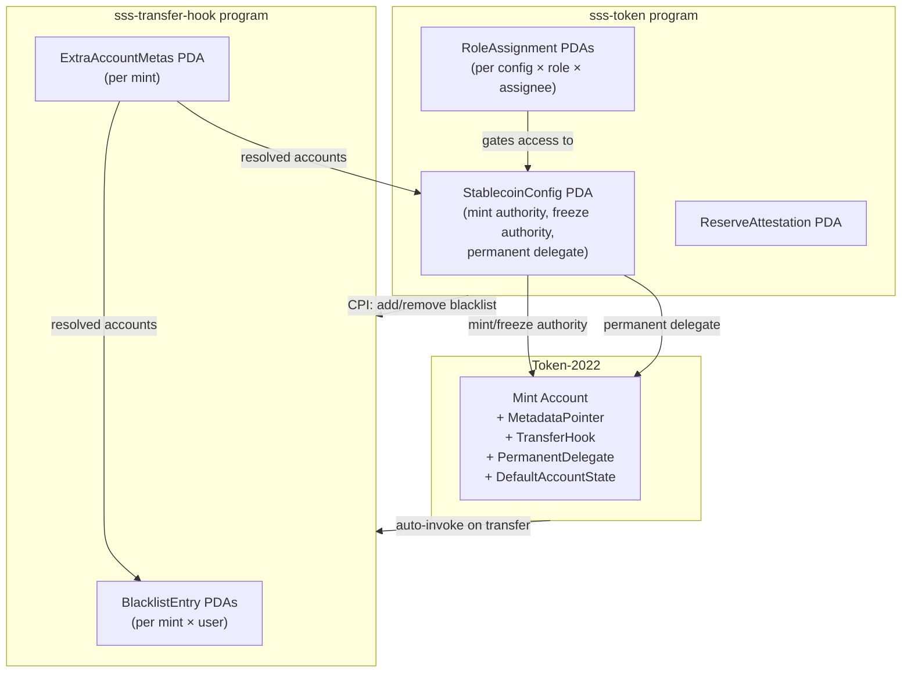
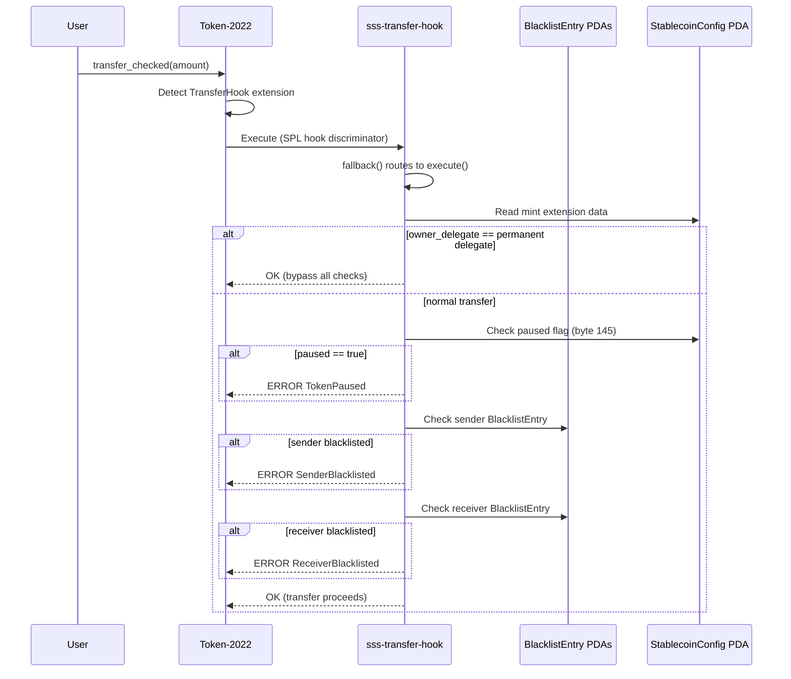

# Architecture

## System Overview

The Solana Stablecoin Standard is a two-program architecture built on Token-2022 (SPL Token Extensions). The main program (`sss-token`) handles all stablecoin lifecycle operations, while the hook program (`sss-transfer-hook`) provides on-chain transfer compliance checks.

```
sss-token (main program)                sss-transfer-hook (hook program)
  17 instructions:                         5 instructions + fallback:
  - initialize                             - initialize_extra_account_metas
  - mint                                   - update_extra_account_metas
  - burn                                   - execute (blacklist + pause check)
  - freeze_account                         - add_to_blacklist (via CPI)
  - thaw_account                           - remove_from_blacklist (via CPI)
  - pause / unpause                        - fallback (SPL Transfer Hook Execute)
  - update_roles
  - update_minter
  - transfer_authority
  - accept_authority
  - cancel_authority_transfer
  - add_to_blacklist (CPI to hook)
  - remove_from_blacklist (CPI to hook)
  - seize (permanent delegate)
  - update_treasury
  - attest_reserves
```

The Config PDA serves as mint authority, freeze authority, and permanent delegate -- ensuring all privileged operations go through the program's access control layer.

### System Overview Diagram



### Transfer Hook Execution Flow



## Two-Program Architecture

### sss-token (Main Program)

Program ID: `tCe3w68q2eo752dzozjGrV8rwhuynfz6T4HtquHf1Gz`

The main program provides 17 instructions covering the full stablecoin lifecycle:

| Instruction | Role Required | SSS Level | Description |
|-------------|--------------|-----------|-------------|
| `initialize` | Authority (signer) | SSS-1 | Create stablecoin with Token-2022 extensions |
| `mint` | Minter | SSS-1 | Mint tokens with quota enforcement |
| `burn` | Burner | SSS-1 | Burn tokens from an account |
| `freeze_account` | Freezer | SSS-1 | Freeze a token account |
| `thaw_account` | Freezer | SSS-1 | Thaw a frozen token account |
| `pause` | Pauser | SSS-1 | Pause all minting and burning |
| `unpause` | Pauser | SSS-1 | Unpause the token |
| `update_roles` | Authority | SSS-1 | Create or update role assignments |
| `update_minter` | Authority | SSS-1 | Set cumulative minting quota |
| `transfer_authority` | Authority | SSS-1 | Initiate two-step authority transfer |
| `accept_authority` | Pending Authority | SSS-1 | Accept pending authority transfer |
| `cancel_authority_transfer` | Authority | SSS-1 | Cancel pending authority transfer |
| `add_to_blacklist` | Blacklister | SSS-2 | Blacklist address via CPI to hook (accepts reason string, max 64 bytes) |
| `remove_from_blacklist` | Blacklister | SSS-2 | Remove address from blacklist via CPI |
| `seize` | Seizer | SSS-2 | Seize all tokens using permanent delegate |
| `update_treasury` | Authority | SSS-1 | Set treasury Pubkey for seized token destination |
| `attest_reserves` | Attestor | SSS-1 | Submit reserve proof; auto-pauses if undercollateralized |

### sss-transfer-hook (Hook Program)

Program ID: `A7UUA9Dbn9XokzuTqMCD9ka4y7x1pQBHJERa92dGAHKB`

The transfer hook program is invoked automatically by Token-2022 on every transfer for SSS-2 tokens:

| Instruction | Description |
|-------------|-------------|
| `initialize_extra_account_metas` | Set up required accounts for hook execution |
| `update_extra_account_metas` | Update extra account metas configuration |
| `execute` | Transfer hook -- checks sender/receiver blacklist + pause state |
| `add_to_blacklist` | Create BlacklistEntry PDA (called via CPI from main program) |
| `remove_from_blacklist` | Close BlacklistEntry PDA (called via CPI from main program) |

The hook program also has a `fallback` handler that routes SPL Transfer Hook Execute interface calls (which use a different discriminator than Anchor's) to the `execute` logic. Token-2022 calls the hook with the SPL Transfer Hook Execute discriminator, not the Anchor discriminator, so this fallback is required for transfers to work.

## PDA Structure and Seeds

### StablecoinConfig PDA

Seeds: `[b"config", mint.key()]`
Size: 214 bytes (8 discriminator + 175 fields + 31 reserved)

```
Offset  Size  Field
0       8     Anchor discriminator
8       32    authority
40      32    pending_authority
72      8     transfer_initiated_at
80      32    mint
112     32    hook_program_id
144     1     decimals
145     1     paused
146     1     enable_transfer_hook
147     1     enable_permanent_delegate
148     1     default_account_frozen
149     1     bump
150     32    treasury
182     1     paused_by_attestation
183     31    _reserved
```

Stores all configuration for a stablecoin including authority, mint address, hook program ID, feature flags, and pause state. The Config PDA itself serves as both the **mint authority** and **freeze authority** for the Token-2022 mint, enabling the program to sign mint/freeze/thaw operations via PDA seeds.

### RoleAssignment PDA

Seeds: `[b"role", config.key(), role_type_byte, assignee.key()]`
Size: 155 bytes (8 discriminator + 83 fields + 64 reserved)

```
Offset  Size  Field
0       8     Anchor discriminator
8       32    config
40      32    assignee
72      1     role_type
73      1     is_active
74      8     minter_quota
82      8     minted_amount
90      1     bump
91      64    _reserved
```

Each role assignment is a separate PDA, allowing multiple independent role holders. The `role_type` byte in the seed ensures one PDA per (config, role, assignee) triple. Minter roles include a cumulative quota (`minter_quota`) and tracked usage (`minted_amount`).

### BlacklistEntry PDA (Hook Program)

Seeds: `[b"blacklist", mint.key(), user.key()]`
Size: 77 + reason_len bytes (8 discriminator + 32 mint + 32 user + 4 + reason_len + 1 bump)

Existence-based blacklist: if the PDA account exists and has data (>= 8 bytes indicating an initialized Anchor account), the address is blacklisted. The `reason` field (max 64 bytes) stores an optional human-readable justification (e.g., "OFAC SDN List"). The transfer hook checks both sender and receiver BlacklistEntry PDAs during every transfer.

### ReserveAttestation PDA

Seeds: `[b"attestation", config.key()]`
Size: Variable

Stores the latest reserve attestation data including reserve amount, token supply, expiration, attestation URI, and validity flag. Created or updated by the `attest_reserves` instruction. If reserves are below token supply, the config's `paused_by_attestation` flag is set to `true`, auto-pausing the token.

### RegistryEntry PDA

Seeds: `[b"registry", mint.key()]`
Size: Variable (8 discriminator + 32 mint + 32 issuer + 1 compliance_level + 8 created_at + (4+name_len) + (4+symbol_len) + 1 decimals + 1 bump + 32 reserved)

Created during `initialize` alongside the StablecoinConfig. Stores the mint address, issuer, compliance level (1 = SSS-1, 2 = SSS-2), creation timestamp, token name, symbol, and decimals. Enables auto-discovery of all SSS stablecoins via a single `getProgramAccounts` call with the RegistryEntry discriminator filter.

### ExtraAccountMetas PDA (Hook Program)

Seeds: `[b"extra-account-metas", mint.key()]`
Size: Variable

Stores the list of additional accounts that Token-2022 must pass to the transfer hook. Includes the sender and receiver BlacklistEntry PDAs (resolved at runtime) and the StablecoinConfig PDA.

## Token-2022 Extension Init Order

SSS uses up to four Token-2022 extensions, initialized in this specific order during `initialize` (from `programs/sss-token/src/instructions/initialize.rs`):

```
Step 1: createAccount (allocate space for extensions, owned by Token-2022)
Step 2: initializePermanentDelegate (config PDA as delegate) [if SSS-2]
Step 3: initializeTransferHook (hook program ID) [if SSS-2]
Step 4: initializeDefaultAccountState (Frozen) [if SSS-2]
Step 5: initializeMetadataPointer (mint points to itself, config as update authority)
Step 6: initializeMint2 (config PDA as both mint authority and freeze authority)
Step 7: initializeTokenMetadata (name, symbol, uri -- signed by config PDA)
```

**Important**: Extensions must be initialized **before** `initializeMint2`. The order above is required by Token-2022. Token metadata is initialized after the mint because it requires the config PDA to sign via `invoke_signed`.

### Extension Details

| Extension | SSS-1 | SSS-2 | Purpose |
|-----------|-------|-------|---------|
| MetadataPointer | Yes | Yes | Points to on-mint metadata (name/symbol/uri) |
| PermanentDelegate | No | Yes | Config PDA as permanent delegate for seizure |
| TransferHook | No | Yes | Blacklist enforcement on every transfer |
| DefaultAccountState | No | Optional | New token accounts start frozen (must thaw before use) |

Note: `default_account_frozen` is set to `false` by the `SSS_2` preset in the SDK. It can be enabled with the `Custom` preset.

### Mint Space Calculation

The `initialize` instruction calculates two space values:
1. **extension_space**: `ExtensionType::try_calculate_account_len` for the selected extensions
2. **metadata_space**: 2 (type) + 2 (length) + 32 (update_authority) + 32 (mint) + (4+name_len) + (4+symbol_len) + (4+uri_len) + 4 (additional_metadata vec)

The account is created with `extension_space` as the initial allocation but funded with lamports for `extension_space + metadata_space`. Token-2022 auto-reallocs when `initializeTokenMetadata` is called.

## Role-Based Access Control

### Role Types (enum values)

| Role | Value | Permissions |
|------|-------|-------------|
| Minter | 0 | `mint` (subject to cumulative quota, checked with `checked_add`) |
| Burner | 1 | `burn` (requires token account owner co-sign) |
| Pauser | 2 | `pause`, `unpause` |
| Freezer | 3 | `freeze_account`, `thaw_account` |
| Blacklister | 4 | `add_to_blacklist`, `remove_from_blacklist` (SSS-2 only) |
| Seizer | 5 | `seize` (SSS-2 only) |
| Attestor | 6 | `attest_reserves` (proof of reserves) |

The authority can assign multiple users to the same role. Each assignment is an independent PDA. Roles can be deactivated (`is_active = false`) without closing the account, allowing reactivation later.

### Validation Functions

All role checks go through utility functions in `programs/sss-token/src/utils/validation.rs`:

- `require_not_paused` -- checks `config.paused == false`
- `require_paused` -- checks `config.paused == true` (for unpause)
- `require_authority` -- checks `config.authority == signer`
- `require_role_active` -- checks `role.role_type` matches expected and `role.is_active == true`
- `require_compliance_enabled` -- checks `config.enable_transfer_hook == true`
- `require_permanent_delegate_enabled` -- checks `config.enable_permanent_delegate == true`

## Config PDA as Mint/Freeze Authority

A critical design decision: the StablecoinConfig PDA serves as both the **mint authority** and **freeze authority** for the Token-2022 mint. This means:

1. Only the sss-token program can mint or freeze tokens (via PDA signing)
2. No external wallet holds mint/freeze authority
3. All mint/freeze operations go through the program's access control checks
4. The permanent delegate (SSS-2) is also the Config PDA, enabling seizure through the same authority

This pattern ensures that the on-chain program enforces all business logic (roles, quotas, pause state) for every privileged operation.

## CPI Architecture

The main program communicates with the hook program via CPI for blacklist operations:

1. `add_to_blacklist`: Main program constructs a raw CPI instruction using the pre-computed Anchor discriminator `HOOK_ADD_BLACKLIST_DISC` (defined in `constants.rs` as `[90, 115, 98, 231, 173, 119, 117, 176]`)
2. `remove_from_blacklist`: Uses `HOOK_REMOVE_BLACKLIST_DISC` (`[47, 105, 20, 10, 165, 168, 203, 219]`)

These discriminators are the first 8 bytes of `sha256("global:<instruction_name>")` for the respective hook program instructions.

For seizure, the main program uses `spl_token_2022::onchain::invoke_transfer_checked` which automatically resolves the transfer hook from the mint's extension data. The client must pass the hook-required accounts as `remaining_accounts`.
